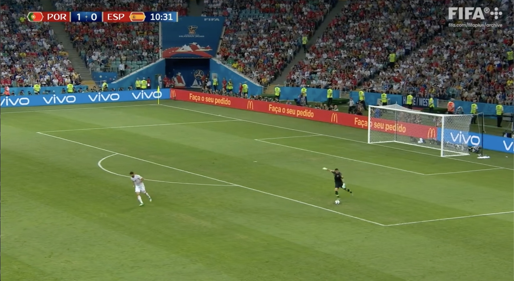
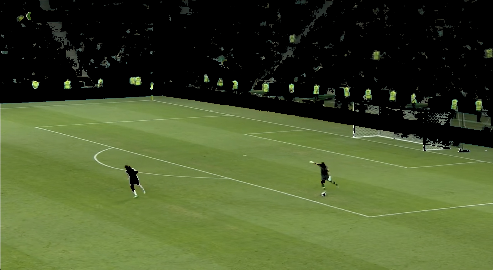
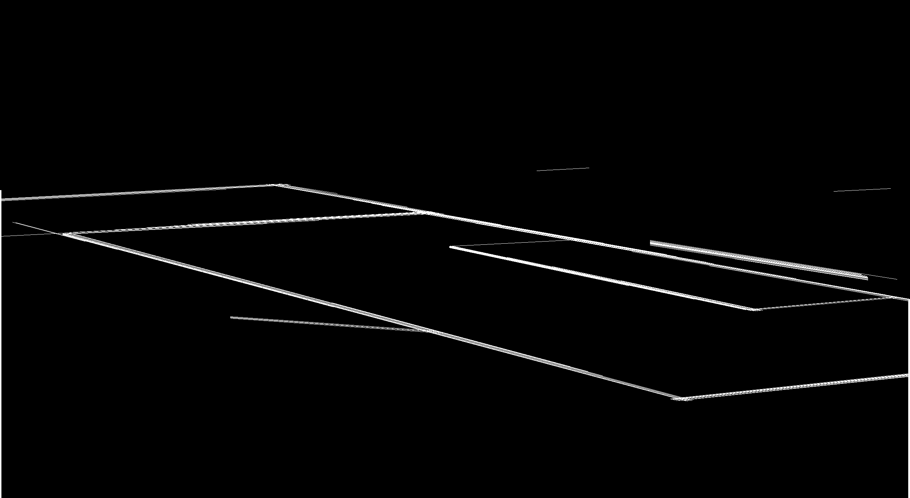
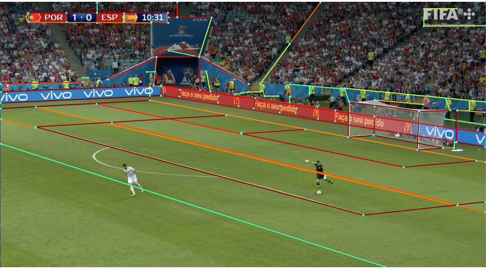
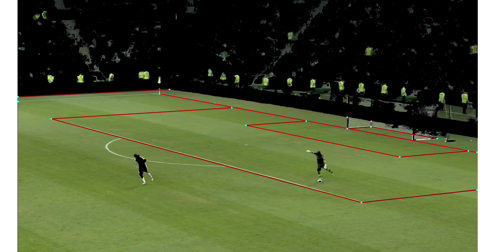
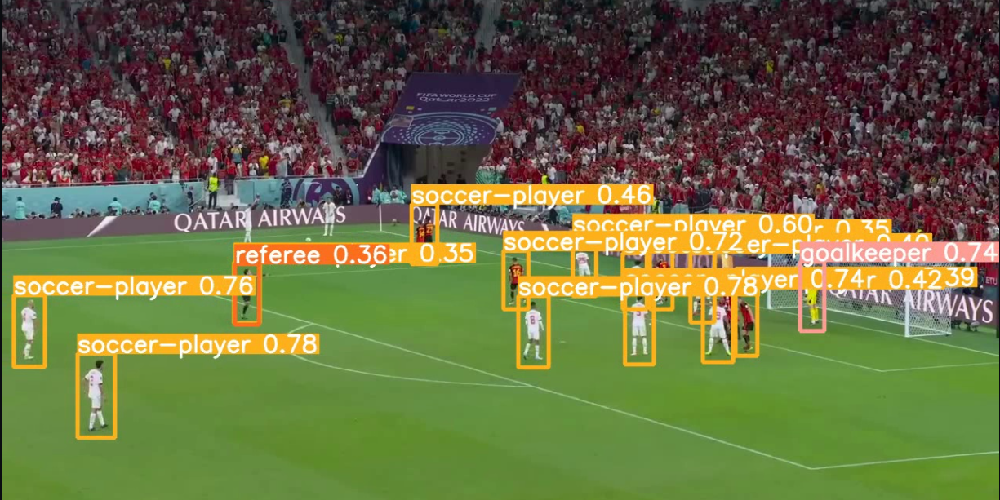

# football-is-life

### weights lcnn: https://drive.google.com/file/d/1NvZkEqWNUBAfuhFPNGiCItjy4iU0UOy2
### weights lcnn path: './lcnn/weights.pth.tar'

----------------------------------------------

### Table of Contents
1. [Objective](#objective)
2. [Flow of Processes](#flow-of-processes)
    - [1. Pitch Detection](#1-pitch-detection)
    - [2. Player Detector](#2-player-detector)
3. [The Input](#the-input)
4. [Different Approaches](#different-approaches)
    - [The Line Segment Detector](#the-line-segment-detector)
    - [LCNN Approach](#lcnn-approach)
5. [Player and Ball Detection](#player-and-ball-detection)

## Objective:

To design and develop a video processing system that can extract and represent player and ball positions on a football match in real-time on a 2D homographic pitch. This system will utilize techniques like object detection, tracking, and homography transformations to accurately place players and the football on a standardized 2D representation of the pitch.

football-is-life is a computer vision annotation tool for football analytics that idenitifies and annotates the boundaries of a football pitch and tracks the position of each player in that pitch and maps those two to a 2D render of the football pitch.

## Flow of Processes

### 1. Pitch Detection 
1.1. Detect Pitch Key Points
Extract frames from the sample video.
Use image processing techniques (e.g., edge detection, contour detection) to identify the boundaries of the pitch.
Detect key pitch landmarks (e.g., goals, corner flags, centre circle).
1.2. Create Pitch Map
Design a 2D representation of a standard pitch.
Map the detected pitch key points from the video frame to the standard pitch representation.
1.3. Pitch Homography to 2D Radar
Compute the homography matrix using matched points from the video frame and the 2D standard pitch.
Warp the video frame to get a bird's-eye view using the homography matrix.

## 2. Player Detector
2.1. Object Detector to Detect Players
Train (or fine-tune) an object detection model (e.g., YOLO, Faster R-CNN) to detect players in the video frames.
2.2. Classification Model for Players
Label sample images of players based on team (Home and Away) and role (referee, GK, regular player).
Train a classification model on the labelled dataset.
2.3. Track Player Route
Implement a tracking algorithm (e.g., SORT, DeepSORT) to follow player movements across frames.
Generate heatmaps based on player routes for game analytics.
2.4. Possession Detector
Fine-tune the object detection model to detect the ball.
Combine ball detection and player tracking to determine which player and team have possession.

### The input

The input for the model will be a frame from the video stream of a football match. For our research images, we extracted a frame from the 2018 World Cup match between Spain and Portugal.

## Different Approaches

## The Line Segment Detector

Our first approach used native cv2 methods to extract as much line information from the image as possible. We did this by first masking the pitch from the stands and the ads, then the image with a gray mask gets fed into a Canny Edge Detector, the output of which gets fed into a Hough Lines Transform.

The problem with this approach for now is that the Hough Lines Transform doesn't provide us with singular lines for the pitch boundaries but rather smaller lines that when put together, give us the full line. We attempted to cluster the lines by slope and intercept but that yielded more confusing results that we couldn't proceed with.

## LCNN Approach

We encountered a [GitHub repo](https://github.com/zhou13/lcnn) for a custom trained CNN for end-to-end wireframing that yielded very promising results in what it detected on the image but it took minutes (on the free GPU on colab) to just render 1 single frame. 

As you can see, it detects the gorund truth lines essentially perfectly but with the cost of noise. So we added the green mask code from the LSD approach and ran it again.

This yielded good results but the computational time was too long.

## Player and Ball Detection

For player and ball detection we have used Yolo-v8 model which was trained to detect football players, goalkeeper, referees, and ball. 

### pretrained yolov8 model: https://github.com/issamjebnouni/YOLOv8-Object-Detection-for-Football/blob/main/runs/detect/train/weights/best.pt

